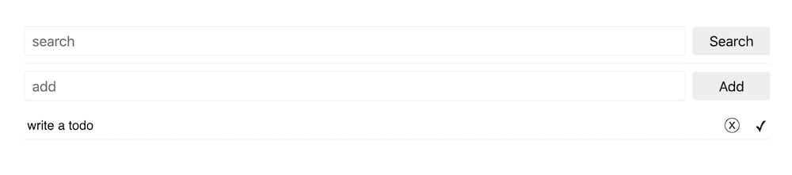
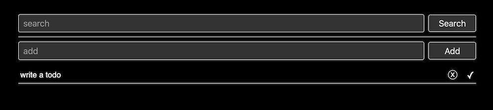

A New List Application
-----------

A self hosted note/todo app built using Parcel, Node, Typescript, Apollo/Graphql, 
React, Tailwind CSS and Prisma 2.



### pre-requisites
* `node` 
* `yarn` or `npm`

### install dependencies
* `yarn` or `npm install`

### setup database
If you do not have a postgres db already, simply set these env vars in `.env`
```
DB_NAME=somedb
DB_USER=someuser
DB_PASSWORD=somepassword
``` 
and then run:
* `docker-compose up db`

Then set the connection url for the Prisma db toolkint in: `prisma/.env` like so:
`DATABASE_URL="postgresql://[someuser]:[somepassword]@[somehost]:[someport]/[someport]?schema=public"`

### bootstrapping Prisma
* `npx prisma generate` 
* `npx prisma migrate save --experimental`
* `npx prisma migrate up --experimental`

This installs the Prisma smart node module, generates the db migrations and runs them against your db.  


### running in dev mode
* `yarn` or `npm install`
* `yarn start` or `npm start` 
* `yarn test` or `npm test`


### build and run in production mode
* `yarn build` or `npm run build`
* `node dist/index.js`

### docker (these require docker, obviously)
* `docker-compose up db` brings up a postgres db in a container (requires .env configs, see above). 
* `docker-componse up app` brings the app up in a container.
* `docker-compose up` brings both the db and the app up in docker.    


### more env vars

You can also change the port and the host the app runs on via .env or env vars. This is 
necessary if you want the client to connect to a non-local server/api.

```
PORT=3000
HOST=0.0.0.0
```

### dark mode!
The app supports an optional dark mode 
via [CSS prefers-color-scheme](https://developer.mozilla.org/en-US/docs/Web/CSS/@media/prefers-color-scheme)


### roadmap/coming soon:
* ~~support for other db providers~~
* ~~production build support~~
* ~~run in docker~~ 
* ~~socket-based push updates~~
* ~~note search~~
* multiple note support
* authentication
* markdown support
* js-free support


